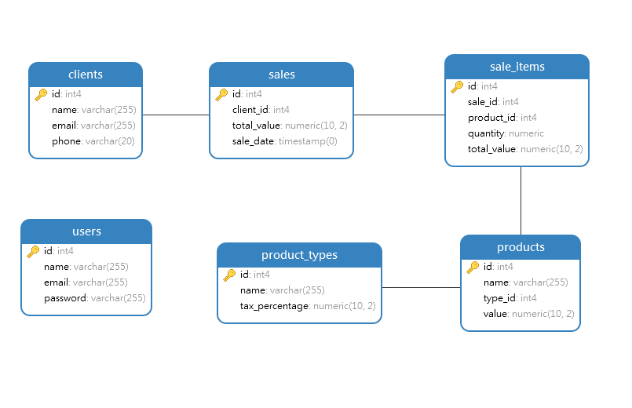

## Projeto Loja PHP + Postgres - Padrão MVC

Este é um projeto simples de uma loja desenvolvido utilizando o padrão de arquitetura MVC (Model-View-Controller) em PHP. O objetivo do projeto é fornecer um exemplo básico de como estruturar e implementar um sistema web.

O projeto consiste em um sistema de loja online com funcionalidades básicas, como exibição de produtos, adição de itens ao carrinho de compras e realização de pedidos. Ele foi desenvolvido com o intuito de servir como um ponto de partida para o aprendizado e prática do padrão MVC em PHP.

# Instalação e Configuração
- Certifique-se de ter o PHP 7.6 ou uma versão superior instalada em seu ambiente.
- Faça o clone deste repositório para o diretório desejado em sua máquina local.
- Navegue até o diretório raiz do projeto no seu terminal.
- Execute o comando 'composer install' para instalar as dependências do projeto.
- Certifique-se de ter o Composer instalado previamente.
- Importe o arquivo 'database.sql' no seu servidor PostgreSQL para criar o banco de dados necessário para o projeto. Certifique-se de ter um servidor PostgreSQL disponível e configurado corretamente.
- Configure as informações de conexão com o banco de dados editando o arquivo config/database.php.
- Após a conclusão da instalação das dependências e configuração do banco de dados, o projeto estará pronto para ser executado.

## Estrutura do Projeto


```sh
├── app
│   ├── controllers
│   │   └── ...
│   ├── models
│   │   └── ...
│   └── views
│       └── ...
├── config
│   └── database.php
├── public
│   ├── css
│   │   └── ...
│   ├── js
│   │   └── ...
│   └── index.php
├── tests
│   ├── ProductTest.php
│   └── SaleTest.php
├── vendor
│   └── ...
├── .gitignore
├── composer.json
├── composer.lock
├── database.sql
├── LICENSE
└── README.md

```

A estrutura do projeto segue a convenção de um projeto MVC padrão em PHP. Aqui está uma breve descrição de cada diretório:

- app: Contém as pastas controllers, models e views, que representam as camadas do padrão MVC. Os arquivos nessas pastas são responsáveis por lidar com a lógica de negócio, manipulação de dados e apresentação visual, respectivamente.
- config: Contém arquivos de configuração do projeto, como database.php, que armazena as informações de conexão com o banco de dados.
- public: Contém os arquivos públicos do projeto, como CSS, JavaScript e o arquivo index.php, que é o ponto de entrada da aplicação.
- tests: Contém os arquivos de teste unitário para os modelos Product e Sale.
- vendor: Pasta do Composer que armazena as dependências do projeto.
- .gitignore: Arquivo que lista os arquivos e diretórios que serão ignorados pelo Git.
- composer.json e composer.lock: Arquivos relacionados ao gerenciamento de dependências com o Composer.
- database.sql: Arquivo SQL para criar o banco de dados necessário para o projeto.
- LICENSE: Arquivo de licença do projeto.
- README.md: Este arquivo que contém informações sobre o projeto.

## Estrutura do Banco de Dados




## Executando o Projeto
- Certifique-se de estar no diretório raiz do projeto no seu terminal.
- Execute o seguinte comando para iniciar o servidor embutido do PHP:

```sh
php -S localhost:8080 -t public
```
- Acesse o projeto em seu navegador web, digitando o seguinte endereço: http://localhost:8080.
- login: admin@admin
- password: admin

O projeto estará funcionando e você poderá navegar pela loja, visualizar os produtos disponíveis e adicionar itens ao carrinho de compras.

## Executando os Testes
- Certifique-se de estar no diretório raiz do projeto no seu terminal.
- Execute o seguinte comando para executar os testes:
```sh
vendor/bin/phpunit
```
Isso irá executar os testes unitários presentes nos arquivos tests/ProductTest.php e tests/SaleTest.php. O PHPUnit irá relatar o resultado dos testes, exibindo informações sobre erros, falhas e estatísticas de execução.

## Licença
Este projeto está licenciado sob a [MIT License](https://pt.wikipedia.org/wiki/Licença_MIT/).

Certifique-se de seguir essas etapas e configurações para garantir uma instalação e execução corretas do projeto PHP MVC Store. Se precisar de mais ajuda, estou à disposição para ajudar!

